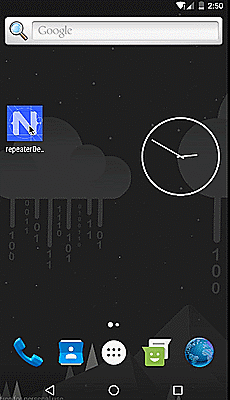

[](https://www.npmjs.com/package/nativescript-number-progressbar)
[](https://www.npmjs.com/package/nativescript-number-progressbar)
[](https://www.npmjs.com/package/nativescript-number-progressbar)

# Nativescript-Number-ProgressBar 
NativeScript Number ProgressBar provides simple ProgressBar with styling.Feedbacks and PRs are most Welcome.

## Demo


 | 
---------- | 
 | 

#### Native Libraries: 
Android | 
---------- | 
[daimajia/NumberProgressBar](https://github.com/daimajia/NumberProgressBar) 

## Installation
From your command prompt/termial go to your app's root folder and execute:

`npm i nativescript-number-progressbar --save`

## Usage
#### XML:
```XML
<Page 
    xmlns="http://schemas.nativescript.org/tns.xsd" 
    xmlns:NumberProgressBar="nativescript-number-progressbar" loaded="pageLoaded"> 
    <Page.actionBar>
      <ActionBar title="Nativescript Number ProgressBar" />
  </Page.actionBar>
  <StackLayout padding="10">
      <NumberProgressBar:NumberProgressBar  id="sb" marginTop="20" />
        <NumberProgressBar:NumberProgressBar  id="sb1" marginTop="30"  progress_text_size="30" progress_text_color="#2BAB42" progress_unreached_bar_height="5" progress_reached_bar_height="10" progress_unreached_color="#ededed" progress_reached_color="#2BAB42" />
       <NumberProgressBar:NumberProgressBar  id="sb2" marginTop="30"  progress_text_size="40" progress_text_color="#F0D812" progress_unreached_bar_height="10" progress_reached_bar_height="20" progress_unreached_color="#ededed" progress_reached_color="#F0D812"  />
       <NumberProgressBar:NumberProgressBar  id="sb3" marginTop="30"  progress_text_size="50" progress_text_color="#F43B5A" progress_unreached_bar_height="20" progress_reached_bar_height="40" progress_unreached_color="#ededed" progress_reached_color="#F43B5A"  />
       <NumberProgressBar:NumberProgressBar  id="sb4" marginTop="30"  progress_text_size="60" progress_text_color="#D726EC" progress_unreached_bar_height="20" progress_reached_bar_height="40" progress_unreached_color="#34EC1A" progress_reached_color="#D726EC"  />

        
  </StackLayout>
</Page>

```

### TS:
```TS

import {NumberProgressBar} from 'nativescript-number-progressbar';
private npb: NumberProgressBar;
this.npb = <NumberProgressBar>mainPage.getViewById('sb');
this.npb.incrementProgressBy(1);

```


## Attributes


There are several attributes you can set:


The **reached area** and **unreached area**:

* color
* height 

The **text area**:

* color
* text size
* visibility
* distance between **reached area** and **unreached area**

The **bar**:

* max progress
* current progress

**progress_text_size - (int)** - *optional*

Attribute to specify the size of text in Progress Bar.

**progress_text_color - (color string)** - *optional*

Attribute to specify the color of text in Progress Bar.

**progress_unreached_color - (color string)** - *optional*

Attribute to specify the color of progress unreached area in Progress Bar.

**progress_reached_color - (color string)** - *optional*

Attribute to specify the color of progress reached area in Progress Bar.

**progress_unreached_bar_height - (int)** - *optional*

Attribute to specify the height of unreached Progress Bar.

**progress_reached_bar_height - (int)** - *optional*

Attribute to specify the height of reached Progress Bar.


## Methods

**incrementProgressBy(int)**

Increment the progress bar with any value.

**getProgress()**

To know the current progress bar value at a time.

**setProgress(int)**

To set the progress bar value.

**getProgressMax()**

To know the progress bar maximum value.

**setProgressMax(int)**

To set the progress bar maximum value.


